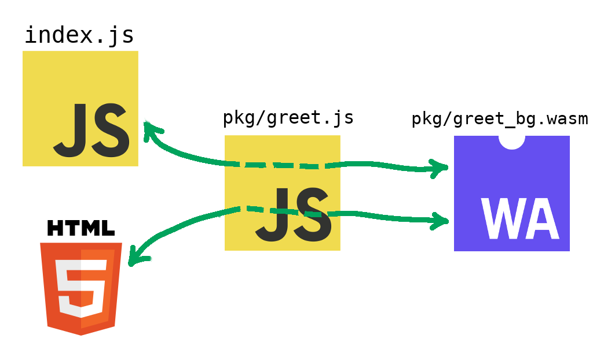
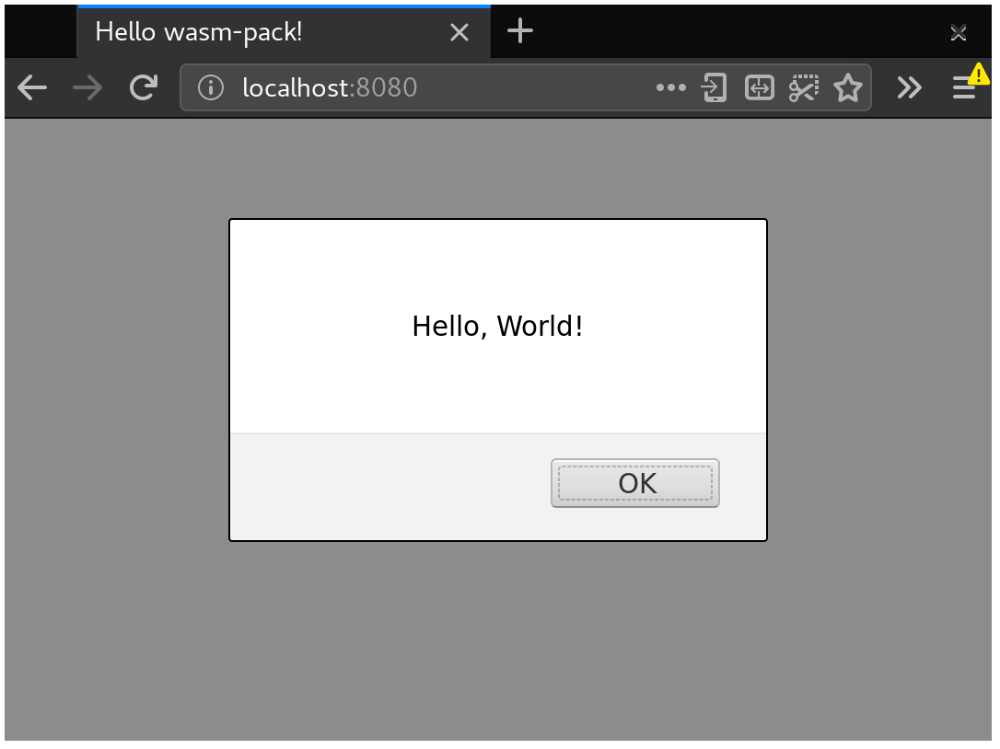
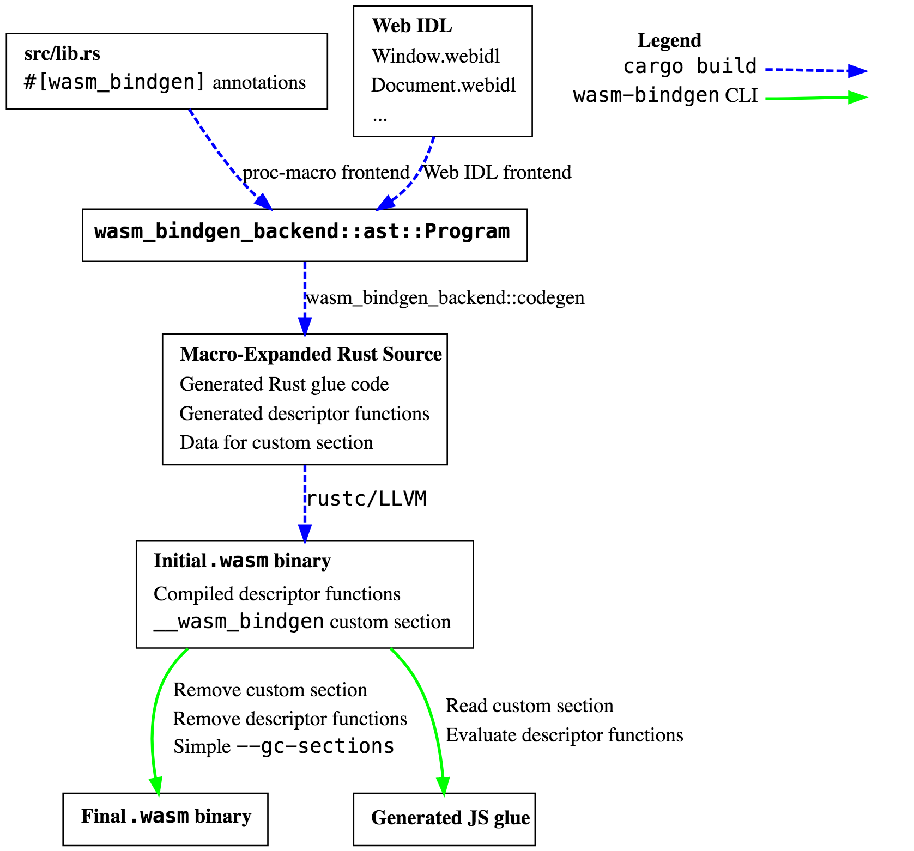

name: none
layout: true

---

name: inverse
layout: true
class: left, middle, inverse

.footnote[[https://fitzgen.github.io/wasm-cg-wasm-bindgen](https://fitzgen.github.io/wasm-cg-wasm-bindgen)]

---

name: normal
layout: true
class: left, middle

.footnote[[https://fitzgen.github.io/wasm-cg-wasm-bindgen](https://fitzgen.github.io/wasm-cg-wasm-bindgen)]

---

class: middle, center

# `wasm-bindgen`
<br/>
#### Nick Fitzgerald
#### [@fitzgen](https://twitter.com/fitzgen) | [@rustwasm](https://twitter.com/rustwasm)

.footnote[[https://fitzgen.github.io/wasm-cg-wasm-bindgen](https://fitzgen.github.io/wasm-cg-wasm-bindgen)]

???

* I'm lead of the rust+wasm WG
* Alex Crichton also on this call
  * has written most of `wasm-bindgen`

---

# Roadmap

<hr/>

### 1. What is `wasm-bindgen`?
### 2. Quick tour of `wasm-bindgen` usage
### 3. How is `wasm-bindgen` implemented?

---

# What is `wasm-bindgen`?

--

<br/>
#### ⚫ Facilitates Wasm and JS communication

--

#### ⚫ Custom ABI between Rust-generated Wasm and JS

--

#### ⚫ Generates bindings glue code to send/receive values

--

#### ⚫ Half polyfill for a Host Bindings future

---

# `js-sys`
<br/>
#### ⚫ Raw `wasm-bindgen` bindings to all the ECMAScript APIs
#### ⚫ Written by hand

---

# `web-sys`
<br/>
#### ⚫ Raw `wasm-bindgen` bindings to Web APIs
#### ⚫ Mechanically generated from Web IDL

---

class: middle, center

# Using `wasm-bindgen`

---

class: js-code

.filename[index.js]

```js
import { greet } from "./pkg/greet";

greet();
```

???

* what is "hello world" of integrating with JS?
  * importing a function with ES modules!
* Rust-generated wasm is consumable as an ES module
* just looking at this, we can't tell if the module is JS or wasm
  * this is the level of transparent, it-just-works integration we aim for

---

class: rust-code

.filename[src/greet.rs]

```rust
use wasm_bindgen::prelude::*;

#[wasm_bindgen]
extern {
    fn alert(s: &str);
}

#[wasm_bindgen]
pub fn greet() {
    alert("Hello, World!");
}
```

???

* Here is how we implement that JS interface with Rust and Wasm
* if you don't know any Rust, don't worry we'll go through this bit by bit

---

class: rust-code

.filename[src/greet.rs]

```rust
*use wasm_bindgen::prelude::*;

#[wasm_bindgen]
extern {
    fn alert(s: &str);
}

#[wasm_bindgen]
pub fn greet() {
    alert("Hello, World!");
}
```

???

* `wasm-bindgen` is the tool we use for facilitating communication between JS
  and wasm
  * more on this later in the talk
* `use` is bringing `wasm-bindgen`'s common functionality into scope

---

class: rust-code

.filename[src/greet.rs]

```rust
use wasm_bindgen::prelude::*;

*#[wasm_bindgen]
*extern {
*   fn alert(s: &str);
*}

#[wasm_bindgen]
pub fn greet() {
    alert("Hello, World!");
}
```

???

* importing the `window.alert` function
* `extern` = these functions exist, but I don't have the definition
* `#[wasm_bindgen]` on an `extern` block creates imports at the `.wasm` level

---

class: rust-code

.filename[src/greet.rs]

```rust
use wasm_bindgen::prelude::*;

#[wasm_bindgen]
extern {
    fn alert(s: &str);
}

*#[wasm_bindgen]
pub fn greet() {
    alert("Hello, World!");
}
```

???

* exporting a `greet` function
  * `#[wasm_bindgen]` on a `pub` function makes it an export in the `.wasm`
    binary

---

class: rust-code

.filename[src/greet.rs]

```rust
use wasm_bindgen::prelude::*;

#[wasm_bindgen]
extern {
    fn alert(s: &str);
}

#[wasm_bindgen]
pub fn greet() {
*   alert("Hello, World!");
}
```

???

* calling imported `alert` function like we would any normal Rust function!

---

class: center, middle

# `wasm-bindgen` CLI
<br/>

#### Generates JS bindings glue: `pkg/greet.js`



???

* your JS interacts with the wasm through the generated JS glue code
* the wasm interacts with DOM/HTML5/Node/etc APIs through the generated JS glue

---

class: js-code

.filename[pkg/greet.js]

```js
// ...

export function __wbg_alert_2c86be282863e459(arg0, arg1) {
    let varg0 = getStringFromWasm(arg0, arg1);
    alert(varg0);
}

// ...
```

???

* the Rust code imported `window.alert`
* so generated JS has glue for wrapping imported functions and translating their
  arguments from numbers to JS things

---

class: js-code

.filename[pkg/greet.js]

```js
// ...

export function __wbg_alert_2c86be282863e459(arg0, arg1) {
*   let varg0 = getStringFromWasm(arg0, arg1);
    alert(varg0);
}

// ...
```

???

* recall from earlier talks that strings aren't simple in wasm
* read a Rust string from wasm memory into a JS string
* arg0 = pointer to start of string
* arg1 = length of the string

---

class: js-code

.filename[pkg/greet.js]

```js
// ...

export function __wbg_alert_2c86be282863e459(arg0, arg1) {
    let varg0 = getStringFromWasm(arg0, arg1);
*   alert(varg0);
}

// ...
```

???

* then call the actual `window.alert` function

---

class: js-code

.filename[pkg/greet.js]

```js
import * as wasm from './greet_bg';

// ...

/**
 * Make a greeting!
 * @returns {void}
 */
export function greet() {
    return wasm.greet();
}
```

???

* the generated JS also wraps the raw wasm exports and provides a nice JS
  interface to them

---

class: js-code

.filename[pkg/greet.js]

```js
*import * as wasm from './greet_bg';

// ...

/**
 * Make a greeting!
 * @returns {void}
 */
export function greet() {
    return wasm.greet();
}
```

???

* this is importing the actual `.wasm` file as an ES module

---

class: js-code

.filename[pkg/greet.js]

```js
import * as wasm from './greet_bg';

// ...

/**
 * Make a greeting!
 * @returns {void}
 */
export function greet() {
*   return wasm.greet();
}
```

???

* the generated JS also wraps the raw wasm exports and provides a nice JS
  interface to them
* it converts and wraps arguments from JS into something that wasm can
  understand
  *  some combination of `i32`/`i64`/`f32`/`f64`
* we just don't have any arguments here yet, so it doesn't do anything
* what if we wanted to write our greeting into a DOM node of the user's choice?

---

class: center

[](./public/img/hello-world.png)

---

class: js-code

.filename[index.js]

```js
import { smorgasbord } from "./pkg/smorgasbord";

const borrowed = {};
const owned = {};
const shouldThrow = Math.random() < 0.5;

smorgasbord(
  borrowedObject,
  owned,
  shouldThrow,
  x => console.log(x)
);
```

???

* TODO

---

class: rust-code

.filename[src/smorgasbord.rs]

```rust
#[wasm_bindgen]
pub fn smorgasbord(
    borrowed: &js_sys::Object,
    owned: js_sys::Object,
    should_throw: bool,
    callback: &js_sys::Function,
) -> Result<JsValue, JsValue> {
    let this = &JsValue::NULL;
    callback.call1(this, borrowed.as_ref())?;
    callback.call1(this, owned.as_ref())?;

    if should_throw {
        Err("uh oh!".into())
    } else {
        Ok(42.into())
    }
}
```

???

* TODO

---

class: rust-code

.filename[src/smorgasbord.rs]

```rust
#[wasm_bindgen]
pub fn smorgasbord(
*   borrowed: &js_sys::Object,
*   owned: js_sys::Object,
*   should_throw: bool,
*   callback: &js_sys::Function,
) -> Result<JsValue, JsValue> {
    let this = &JsValue::NULL;
    callback.call1(this, borrowed.as_ref())?;
    callback.call1(this, owned.as_ref())?;

    if should_throw {
        Err("uh oh!".into())
    } else {
        Ok(42.into())
    }
}
```

???

* TODO

---

class: rust-code

.filename[src/smorgasbord.rs]

```rust
#[wasm_bindgen]
pub fn smorgasbord(
    borrowed: &js_sys::Object,
    owned: js_sys::Object,
    should_throw: bool,
*   callback: &js_sys::Function,
) -> Result<JsValue, JsValue> {
    let this = &JsValue::NULL;
*   callback.call1(this, borrowed.as_ref())?;
*   callback.call1(this, owned.as_ref())?;

    if should_throw {
        Err("uh oh!".into())
    } else {
        Ok(42.into())
    }
}
```

???

* we can call methods of objects, eg `Function.prototype.call`

---

class: rust-code

.filename[src/smorgasbord.rs]

```rust
#[wasm_bindgen]
pub fn smorgasbord(
    borrowed: &js_sys::Object,
    owned: js_sys::Object,
    should_throw: bool,
    callback: &js_sys::Function,
*) -> Result<JsValue, JsValue> {
    let this = &JsValue::NULL;
*   callback.call1(this, borrowed.as_ref())?;
*   callback.call1(this, owned.as_ref())?;

    if should_throw {
*       Err("uh oh!".into())
    } else {
*       Ok(42.into())
    }
}
```

???

* `Result` return types allow one to express fallible operations, propagate
  exceptions, throw new exceptions

---

class: js-code

.filename[pkg/smorgasbord.js]

```js
const __wbg_call_bd08bd79389c3e82_target = Function.prototype.call;

export function __wbg_call_bd08bd79389c3e82(
  arg0, arg1, arg2, exnptr
  ) {
  try {
    return addHeapObject(__wbg_call_bd08bd79389c3e82_target.call(
      getObject(arg0), getObject(arg1), getObject(arg2)
    ));
  } catch (e) {
    const view = getUint32Memory();
    view[exnptr / 4] = 1;
    view[exnptr / 4 + 1] = addHeapObject(e);
  }
}
```

???

* this is the import wrapping `Function.prototype.call` that is called by the
  wasm

---

class: js-code

.filename[pkg/smorgasbord.js]

```js
export function smorgasbord(arg0, arg1, arg2, arg3) {
  try {
    return takeObject(wasm.smorgasbord(
      addBorrowedObject(arg0),
      addHeapObject(arg1),
      addBorrowedObject(arg2),
      arg3 ? 1 : 0
    ));
  } finally {
    stack.pop();
    stack.pop();
  }
}
```

---

TODO

---

class: center

# How it's Made


???

* let's peak under the hood
* see how the sausage is made

---

class: center

[](./public/img/wasm-bindgen-pipeline.png)

---

exclude: true

* wish that WebIDL would specify whether buffer source is const or not
* wish that TypeScript included whether a method throws or not

---

template: inverse
class: center

# THANK YOU!
<br/>
### Nick Fitzgerald
<br/>
### [@fitzgen](https://twitter.com/fitzgen) | [@rustwasm](https://twitter.com/rustwasm)
