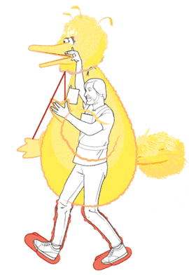

name: none
layout: true

---

name: inverse
layout: true
class: left, middle, inverse

.footnote[[fitzgen.github.io/wasm-cg-wasm-bindgen](https://fitzgen.github.io/wasm-cg-wasm-bindgen)]

---

name: normal
layout: true
class: left, middle

.footnote[[fitzgen.github.io/wasm-cg-wasm-bindgen](https://fitzgen.github.io/wasm-cg-wasm-bindgen)]

---

class: middle, center

# `wasm-bindgen` &mdash; how does it work?!
<br/>
#### Nick Fitzgerald
#### [@fitzgen](https://twitter.com/fitzgen) | [@rustwasm](https://twitter.com/rustwasm)

.footnote[[fitzgen.github.io/wasm-cg-wasm-bindgen](https://fitzgen.github.io/wasm-cg-wasm-bindgen)]

???

* I'm lead of the rust+wasm WG
* Alex Crichton also on this call
  * has written most of `wasm-bindgen`

---

# Roadmap

<hr/>

### 1. What is `wasm-bindgen`?
### 2. Quick tour of `wasm-bindgen` usage
### 3. How is `wasm-bindgen` implemented?

---

# What is `wasm-bindgen`?

--

<br/>
#### ⚫ Facilitates Wasm and JS communication

--

#### ⚫ Custom ABI between Wasm and JS

--

#### ⚫ Generates bindings glue code to send/receive values

--

#### ⚫ Sort of a polyfill for `anyref` and host bindings

---

# `js-sys`
<br/>
#### ⚫ Raw `wasm-bindgen` bindings to all the ECMAScript APIs
#### ⚫ Written by hand

---

# `web-sys`
<br/>
#### ⚫ Raw `wasm-bindgen` bindings to Web APIs
#### ⚫ Mechanically generated from Web IDL

---

class: middle, center

# Using `wasm-bindgen`

---

class: js-code

.filename[index.js]

```js
import { greet } from "./pkg/greet";

greet();
```

???

* what is "hello world" of integrating with JS?
  * importing a function with ES modules!
* Rust-generated wasm is consumable as an ES module
* just looking at this, we can't tell if the module is JS or wasm
  * this is the level of transparent, it-just-works integration we aim for

---

class: rust-code

.filename[src/greet.rs]

```rust
use wasm_bindgen::prelude::*;

#[wasm_bindgen]
extern {
    fn alert(s: &str);
}

#[wasm_bindgen]
pub fn greet() {
    alert("Hello, World!");
}
```

???

* Here is how we implement that JS interface with Rust and Wasm
* if you don't know any Rust, don't worry we'll go through this bit by bit

---

class: rust-code

.filename[src/greet.rs]

```rust
*use wasm_bindgen::prelude::*;

#[wasm_bindgen]
extern {
    fn alert(s: &str);
}

#[wasm_bindgen]
pub fn greet() {
    alert("Hello, World!");
}
```

???

* `wasm-bindgen` is the tool we use for facilitating communication between JS
  and wasm
  * more on this later in the talk
* `use` is bringing `wasm-bindgen`'s common functionality into scope

---

class: rust-code

.filename[src/greet.rs]

```rust
use wasm_bindgen::prelude::*;

*#[wasm_bindgen]
*extern {
*   fn alert(s: &str);
*}

#[wasm_bindgen]
pub fn greet() {
    alert("Hello, World!");
}
```

???

* importing the `window.alert` function
* `extern` = these functions exist, but I don't have the definition
* `#[wasm_bindgen]` on an `extern` block creates imports at the `.wasm` level

---

class: rust-code

.filename[src/greet.rs]

```rust
use wasm_bindgen::prelude::*;

#[wasm_bindgen]
extern {
    fn alert(s: &str);
}

*#[wasm_bindgen]
pub fn greet() {
    alert("Hello, World!");
}
```

???

* exporting a `greet` function
  * `#[wasm_bindgen]` on a `pub` function makes it an export in the `.wasm`
    binary

---

class: rust-code

.filename[src/greet.rs]

```rust
use wasm_bindgen::prelude::*;

#[wasm_bindgen]
extern {
    fn alert(s: &str);
}

#[wasm_bindgen]
pub fn greet() {
*   alert("Hello, World!");
}
```

???

* calling imported `alert` function like we would any normal Rust function!

---

class: center, middle

# `wasm-bindgen` CLI
<br/>

#### Generates JS bindings glue: `pkg/greet.js`


???

* your JS interacts with the wasm through the generated JS glue code
* the wasm interacts with DOM/HTML5/Node/etc APIs through the generated JS glue

---

class: js-code

.filename[pkg/greet.js]

```js
// ...

export function __wbg_alert_2c86be282863e459(arg0, arg1) {
    let varg0 = getStringFromWasm(arg0, arg1);
    alert(varg0);
}

// ...
```

???

* the Rust code imported `window.alert`
* so generated JS has glue for wrapping imported functions and translating their
  arguments from numbers to JS things

---

class: js-code

.filename[pkg/greet.js]

```js
// ...

export function __wbg_alert_2c86be282863e459(arg0, arg1) {
*   let varg0 = getStringFromWasm(arg0, arg1);
    alert(varg0);
}

// ...
```

???

* recall from earlier talks that strings aren't simple in wasm
* read a Rust string from wasm memory into a JS string
* arg0 = pointer to start of string
* arg1 = length of the string

---

class: js-code

.filename[pkg/greet.js]

```js
// ...

export function __wbg_alert_2c86be282863e459(arg0, arg1) {
    let varg0 = getStringFromWasm(arg0, arg1);
*   alert(varg0);
}

// ...
```

???

* then call the actual `window.alert` function

---

class: js-code

.filename[pkg/greet.js]

```js
import * as wasm from './greet_bg';

// ...

export function greet() {
    return wasm.greet();
}
```

???

* the generated JS also wraps the raw wasm exports and provides a nice JS
  interface to them

---

class: js-code

.filename[pkg/greet.js]

```js
*import * as wasm from './greet_bg';

// ...

export function greet() {
    return wasm.greet();
}
```

???

* this is importing the actual `.wasm` file as an ES module

---

class: js-code

.filename[pkg/greet.js]

```js
import * as wasm from './greet_bg';

// ...

export function greet() {
*   return wasm.greet();
}
```

???

* the generated JS also wraps the raw wasm exports and provides a nice JS
  interface to them
* it converts and wraps arguments from JS into something that wasm can
  understand
  *  some combination of `i32`/`i64`/`f32`/`f64`
* we just don't have any arguments here yet, so it doesn't do anything
* what if we wanted to write our greeting into a DOM node of the user's choice?

---

class: center

[](./public/img/hello-world.png)

---

class: js-code

.filename[index.js]

```js
import { smorgasbord } from "./pkg/smorgasbord";

const borrowed = {};
const owned = {};
const shouldThrow = Math.random() < 0.5;

smorgasbord(
  borrowedObject,
  owned,
  shouldThrow,
  x => console.log(x)
);
```

---

class: rust-code

.filename[src/smorgasbord.rs]

```rust
#[wasm_bindgen]
pub fn smorgasbord(
    borrowed: &js_sys::Object,
    owned: js_sys::Object,
    should_throw: bool,
    callback: &js_sys::Function,
) -> Result<JsValue, JsValue> {
    let this = &JsValue::NULL;
    callback.call1(this, borrowed.as_ref())?;
    callback.call1(this, owned.as_ref())?;

    if should_throw {
        Err("uh oh!".into())
    } else {
        Ok(42.into())
    }
}
```

---

class: rust-code

.filename[src/smorgasbord.rs]

```rust
#[wasm_bindgen]
pub fn smorgasbord(
*   borrowed: &js_sys::Object,
*   owned: js_sys::Object,
*   should_throw: bool,
*   callback: &js_sys::Function,
) -> Result<JsValue, JsValue> {
    let this = &JsValue::NULL;
    callback.call1(this, borrowed.as_ref())?;
    callback.call1(this, owned.as_ref())?;

    if should_throw {
        Err("uh oh!".into())
    } else {
        Ok(42.into())
    }
}
```

---

class: rust-code

.filename[src/smorgasbord.rs]

```rust
#[wasm_bindgen]
pub fn smorgasbord(
    borrowed: &js_sys::Object,
    owned: js_sys::Object,
    should_throw: bool,
*   callback: &js_sys::Function,
) -> Result<JsValue, JsValue> {
    let this = &JsValue::NULL;
*   callback.call1(this, borrowed.as_ref())?;
*   callback.call1(this, owned.as_ref())?;

    if should_throw {
        Err("uh oh!".into())
    } else {
        Ok(42.into())
    }
}
```

???

* we can call methods of objects, eg `Function.prototype.call`

---

class: rust-code

.filename[src/smorgasbord.rs]

```rust
#[wasm_bindgen]
pub fn smorgasbord(
    borrowed: &js_sys::Object,
    owned: js_sys::Object,
    should_throw: bool,
    callback: &js_sys::Function,
*) -> Result<JsValue, JsValue> {
    let this = &JsValue::NULL;
*   callback.call1(this, borrowed.as_ref())?;
*   callback.call1(this, owned.as_ref())?;

    if should_throw {
*       Err("uh oh!".into())
    } else {
*       Ok(42.into())
    }
}
```

???

* `Result` return types allow one to express fallible operations, propagate
  exceptions, throw new exceptions

---

class: center

# How it's Made



???

* let's peak under the hood
* see how the sausage is made

---

class: center

[](./public/img/wasm-bindgen-pipeline.png)

---

class: center

# Passing JS Objects

---

### ⚫ Stack for borrowed objects
### ⚫ Heap w/ simple free list for owned objects
### ⚫ `i32` at raw ABI level

```
      Index                     Heap or stack bit
        |                             |
        V                             V
+-----------------------------------+---+
| 0 0 0 0 0 0 0 0 0 0 0 0 1 0 1 0 1 | 1 |
+-----------------------------------+---+
```

---

class: rust-code
.filename[src/by_ref.rs]

```rust
#[wasm_bindgen]
pub fn by_ref(a: &JsValue) {
    // ...
}
```

---

class: js-code
.filename[pkg/by_ref.js]

```js
import * as wasm from './by_ref_bg';

const stack = [];

function addBorrowedObject(obj) {
  stack.push(obj);
  return ((stack.length - 1) << 1) | 1;
}

export function by_ref(arg0) {
  try {
    return wasm.by_ref(addBorrowedObject(arg0));
  } finally {
    stack.pop();
  }
}
```

---

class: rust-code
.filename[src/by_val.rs]

```rust
#[wasm_bindgen]
pub fn by_val(a: JsValue) {
    // ...
}
```

---

class: js-code
.filename[pkg/by_val.js]

```js
import * as wasm from './by_val_bg';

const slab = [{ obj: undefined }, { obj: null },
              { obj: true }, { obj: false }];
let slab_next = slab.length;

function addHeapObject(obj) {
  if (slab_next === slab.length) slab.push(slab.length + 1);
  const idx = slab_next;
  const next = slab[idx];

  slab_next = next;

  slab[idx] = { obj, cnt: 1 };
  return idx << 1;
}

export function by_val(arg0) {
  return wasm.by_val(addHeapObject(arg0));
}

// ...
```

---

class: js-code
.filename[pkg/by_val.js]

```js
// ...

function dropRef(idx) {
  idx = idx >> 1;
  if (idx < 4) return;
  let obj = slab[idx];

  obj.cnt -= 1;
  if (obj.cnt > 0) return;

  // If we hit 0 then free up our space in the slab
  slab[idx] = slab_next;
  slab_next = idx;
}

export function __wbindgen_object_drop_ref(i) {
  dropRef(i);
}
```

---

class: rust-code
.filename[src/jsvalue.rs]

```rust
pub struct JsValue {
    idx: u32,
}

// "private" constructors

impl Drop for JsValue {
    fn drop(&mut self) {
        unsafe {
            __wbindgen_object_drop_ref(self.idx);
        }
    }
}
```

---

class: center

# Imported JS Classes with Methods

---

class: rust-code
.filename[src/append_child.rs]

```rust
#[wasm_bindgen]
extern {
    pub type Node;

    #[wasm_bindgen(method, js_name = appendChild)]
    fn append_child(this: &Node, child: &Node);
}

#[wasm_bindgen]
pub fn do_append(parent: &Node, child: &Node) {
    parent.append_child(child);
}
```

---

class: js-code
.filename[pkg/append_child.js]

```js
// ...

const __wbg_appendChild_e6dc06d55fb84bbc_target =
  Node.prototype.appendChild;

export function __wbg_appendChild_e6dc06d55fb84bbc(arg0, arg1) {
  __wbg_appendChild_e6dc06d55fb84bbc_target.call(
    getObject(arg0),
    getObject(arg1)
  );
}

function getObject(idx) {
  if ((idx & 1) === 1) {
    return stack[idx >> 1];
  } else {
    const val = slab[idx >> 1];
    return val.obj;
  }
}
```

---

class: center

# Converting into and from the ABI on the Rust side

---

class: rust-code

```rust
/// An unsafe trait which represents types that are ABI-safe to
/// pass via raw wasm arguments.
pub unsafe trait WasmAbi {}

unsafe impl WasmAbi for u32 {}
unsafe impl WasmAbi for i32 {}
unsafe impl WasmAbi for f32 {}
unsafe impl WasmAbi for f64 {}
```

---

class: rust-code

```rust
pub trait IntoWasmAbi: WasmDescribe {
    /// The wasm ABI type that this converts into.
    type Abi: WasmAbi;

    /// Convert into the raw ABI type so that it can be sent
    /// across the wasm ABI boundary.
    fn into_abi(self, extra: &mut Stack) -> Self::Abi;
}
```

---

class: rust-code

```rust
impl IntoWasmAbi for JsValue {
    type Abi = u32;

    #[inline]
    fn into_abi(self, _extra: &mut Stack) -> u32 {
        let ret = self.idx;
        // Don't run the destructor -- the JS glue will handle it.
        mem::forget(self);
        ret
    }
}
```

---

class: rust-code

```rust
pub trait FromWasmAbi: WasmDescribe {
    /// The raw wasm ABI type that this converts from.
    type Abi: WasmAbi;

    /// Recover the value from the raw ABI type.
    unsafe fn from_abi(js: Self::Abi, extra: &mut Stack) -> Self;
}
```

---

class: rust-code

```rust
impl FromWasmAbi for JsValue {
    type Abi = u32;

    #[inline]
    unsafe fn from_abi(idx: u32, _extra: &mut Stack) -> JsValue {
        JsValue { idx }
    }
}
```

---

class: rust-code
.filename[src/take_send.rs]

```rust
#[wasm_bindgen]
extern {
    fn send_to_js(val: JsValue);
}

#[wasm_bindgen]
pub fn take_from_js(val: JsValue) -> u32 {
    send_to_js(val);
    42
}
```

---

class: rust-code
.filename[src/take_send.rs (macro-expanded)]

```rust
fn send_to_js(val: JsValue) {
    #[link(wasm_import_module = "pkg/take_send.js")]
    extern {
        fn __wbg_sendtojs_8b4761129afd1491(
            val: <JsValue as IntoWasmAbi>::Abi,
        );
    }
    unsafe {
        let _ret = {
            let mut __stack = GlobalStack::new();
            let val = <JsValue as IntoWasmAbi>::into_abi(
                val,
                &mut __stack
            );
            __wbg_sendtojs_8b4761129afd1491(val)
        };
    }
}
```

---

class: rust-code
.filename[src/take_send.rs (macro-expanded)]

```rust
#[export_name = "take_from_js"]
pub extern "C" fn __wasm_bindgen_generated_take_from_js(
    arg0: <JsValue as FromWasmAbi>::Abi,
) -> <u32 as ReturnWasmAbi>::Abi {
    let _ret = {
        let mut __stack = unsafe { GlobalStack::new() };
        let arg0 = unsafe {
            <JsValue as FromWasmAbi>::from_abi(arg0, &mut __stack)
        };
        take_from_js(arg0)
    };
    <u32 as ReturnWasmAbi>::return_abi(_ret, &mut unsafe {
        GlobalStack::new()
    })
}
```

---

## There's also
<br/>
#### `pub trait RefFromWasmAbi`
#### `pub trait RefMutFromWasmAbi`
#### `pub trait OptionIntoWasmAbi`
#### `pub trait OptionFromWasmAbi`
#### `pub trait ReturnWasmAbi`

---

class: center

# `WasmDescribe` and the Custom Section
### Ask about it later if you're curious...

---

class: center

# Wishes
# 

---

class: center

### That `Class.prototype.method.call(receiver, ...)` was as fast as `receiver.method(...)`

---

class: center

### That ECMAScript specified its global APIs with Web IDL

---

class: center

### That the `[Throws]` Web IDL attribute was standard, and not just a Gecko-ism

---

class: center

### That Web IDL specified whether a `BufferSource` is const or not

---

class: center

### That TypeScript signatures included whether a function/method throws or not

---

class: center

### That Rust had generic, monomorphized `static`s

---

class: center

# Future Goals

---

class: center

## Replace stack and heap of JS values with `anyref` table

---

class: center

## Replace generated JS import glue with host bindings

---

class: center

# Thank you!
<br/>
### Nick Fitzgerald
### [@fitzgen](https://twitter.com/fitzgen) | [@rustwasm](https://twitter.com/rustwasm)
